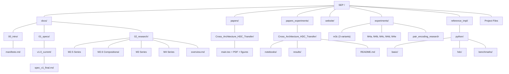

# SEP Project Structure

This document serves as the canonical map for the SEP Monorepo, defining the single source of truth for specifications, implementations, and documentation.

## Core Hierarchy

The repository is organized by function to support development across documentation (Docusaurus), experimental validation, and reference implementations.



## Folder Descriptions

### 1. `/docs` (Single Source of Truth)

Contains all Markdown documentation that is published via Docusaurus.

| Folder | Content | Notes |
|--------|---------|-------|
| `00_intro/` | High-level philosophy and project manifest | Contains **manifesto.md** (Level 0) |
| `01_specs/` | Technical specifications and protocol standards | |
| `01_specs/v1.0_current/` | The active, implemented Level 1 standard | Contains **spec_v1_final.md** |
| `02_research/` | Experimental validation documentation | M2.5, M2.6, M3, M4 series |

#### Research Documentation

| File | Description |
|------|-------------|
| `overview.md` | Research timeline and summary of all experiments |
| `m2-5-curriculum.md` | HDC-guided curriculum learning |
| `m2-5-data-curation.md` | HDC-based data curation |
| `m2-6-compositional.md` | Compositional generalization (100% accuracy) |
| `m3-series.md` | Distributed intelligence (M3a, M3b, M3c) |
| `m4-series.md` | Semantic transfer (M4c cross-lingual, M4d compositionality, M4e vs KD) |

### 2. `/papers` (Published Papers)

Contains final PDF versions of published academic papers. LaTeX sources and working files are kept locally but not committed to the repository.

| Folder | Description | Status |
|--------|-------------|--------|
| `Cross_Architecture_HDC_Transfer/` | Cross-architecture knowledge transfer via HDC | Published on [Zenodo](https://zenodo.org/records/18009693) |
| `Encoder_Free_HDC/` | Encoder-free text classification using HDC | Published on [Zenodo](https://doi.org/10.5281/zenodo.18025695) |

**What's included in git:**
- `*.pdf` - Final compiled PDFs only

**What's excluded (local only):**
- LaTeX sources (`*.tex`, `*.bib`)
- Figures and diagrams (`*.png`, `*.jpg`)
- Build scripts (`generate_figures.py`)
- Temporary build files (`*.aux`, `*.log`, etc.)

**Rationale:** We publish final papers on Zenodo and include PDFs in the repository for easy access. LaTeX sources remain private during the writing process.

### 3. `/papers_experiments` (Reproducible Experiments for Papers)

Contains experimental code, Jupyter notebooks, and results that validate claims made in published papers. Each paper has its own subfolder with notebooks and documentation.

| Paper | Folder | Contents |
|-------|--------|----------|
| Cross-Architecture HDC Transfer | `Cross_Architecture_HDC_Transfer/` | 2 notebooks, results, README |
| Encoder-Free HDC | `Encoder_Free_HDC/` | 1 notebook, results, README |

**Structure (per paper):**
- `README.md` - Detailed experiment documentation
- `notebooks/` - Jupyter notebooks with reproducible experiments
- `results/` - Generated plots (`.png`) and data (`.json`)

**Example:**
```
papers_experiments/
└── Cross_Architecture_HDC_Transfer/
    ├── README.md
    ├── notebooks/
    │   ├── Paper1_Experiment1_Complete_Pipeline.ipynb
    │   └── Paper1_Experiment2_Teacher_Size.ipynb
    └── results/
        ├── stage1_hdc_dimension.png
        ├── stage2_alignment_methods.png
        └── experiment1_complete.json
```

### 4. `/experiments` (Experimental Validation)

Contains all experimental code, notebooks, and results validating SEP protocol claims.

#### M3 Series: HDC Transfer Experiments

| Folder | Description | Key Result |
|--------|-------------|------------|
| `m3c_hdc_transfer/` | Cross-architecture transfer (ResNet→MobileNet) | 59% success |
| `m3c_optimization/` | Optimization experiments (baseline through 5000 examples) | 77% best |
| `m3c_final_results/` | Final corrected metrics | Student Accuracy stable metric |

#### M4 Series: Semantic Transfer & Universal Meaning

| Folder | Description | Key Result |
|--------|-------------|------------|
| `m4a_hdc_transfer/` | NLP transfer (IMDB, AG News, MNLI) | Pair encoding bottleneck identified |
| `m4c_crosslingual/` | Cross-lingual transfer (10 languages) | 91.3% transfer ratio |
| `m4d_compositionality/` | Semantic arithmetic (word analogies) | 110% retention |
| `m4e_hdc_vs_kd/` | Comparison with Knowledge Distillation | 98.4% competitive |

#### Advanced Research

| Folder | Description |
|--------|-------------|
| `pair_encoding_research/` | 4-phase investigation solving NLI pair encoding (Phase 1-4, Learned Compression) |

**Each experiment folder contains:**
- `README.md` - Full documentation
- Jupyter notebooks (`.ipynb`)
- Results (`.json`, `.png`)
- Checkpoints (where applicable)

### 5. `/website` (Web Front-end)

Contains the Docusaurus configuration and static assets for [seprotocol.ai](https://seprotocol.ai).

| File/Folder | Purpose | Status |
|-------------|---------|--------|
| `src/` | Custom pages, styles, and React components | Essential for look & feel |
| `src/pages/` | Main landing page, demo page | Custom React components |
| `src/components/` | Reusable components (BenchmarkViz, etc.) | |
| `static/` | Static assets (images, PDFs, research materials) | |
| `docusaurus.config.js` | Site structure, navigation, and plugins | |
| `sidebars.js` | Defines the hierarchical menu for documentation | |
| `package.json` | Project dependencies (Node/NPM) | |
| `build/` | **Ignored.** Generated static site output | Stored only on the web server |

### 6. `/reference_impl` (Code Implementations)

Contains runnable codebases that adhere strictly to the Level 1 Specification.

#### Python Reference Implementation

| Folder | Description | Status |
|--------|-------------|--------|
| `basic/` | Basic semantic event sender/receiver | MVP Complete |
| `hdc/` | HDC encoding, training, transfer | Core implementation |
| `benchmarks/` | MQTT vs SEP comparison | Quantitative validation |
| `assets/` | Demo recordings and assets | |

**Key modules:**
- `hdc/ternary_encoder.py` - HDC encoding with ternary quantization
- `hdc/distributed_trainer_hdc.py` - Multi-node training
- `hdc/knowledge_transfer.py` - Cross-architecture transfer
- `benchmarks/mqtt_vs_resonance.py` - Protocol comparison

**Future:**
- `cpp/` - Low-power microcontroller deployment (ESP32, Level 2)

## Project Files (Root)

| File | Purpose | Notes |
|------|---------|-------|
| `.gitignore` | **CRITICAL.** Excludes build artifacts | Ensures clean Git history |
| `README.md` | General project overview and quick start guide | |
| `PROJECT_STRUCTURE.md` | **This file.** Canonical project map | |
| `ROADMAP.md` | Development roadmap and milestones | |
| `CONTRIBUTING.md` | Contribution guidelines | |
| `GOVERNANCE.md` | Project governance model | |
| `LICENSE` | Project license | |

## Key Experimental Results (Quick Reference)

| Series | Key Metric | Result |
|--------|------------|--------|
| **M2.5** | Data efficiency | HDC competitive with Sentence Transformers |
| **M2.6** | Compositional generalization | 100% accuracy on unseen combinations |
| **M3a** | Distributed training | 2 nodes, 17.5MB/round |
| **M3b** | HDC compression | 32× reduction (271KB/round) |
| **M3c** | Cross-architecture transfer | 93% efficiency (DistilBERT→GPT-2) |
| **M3c′** | Optimized transfer | 77% student accuracy (2000 examples) |
| **M4a** | NLP transfer | Pair encoding bottleneck identified |
| **M4c** | Cross-lingual | 91.3% transfer across 10 languages |
| **M4d** | Compositionality | 110% retention (ternary improves!) |
| **M4e** | HDC vs KD | 98.4% competitive with unique properties |

## Navigation Guide

**For researchers:**
- Start with `/docs/00_intro/manifesto.md` for philosophy
- Read `/docs/01_specs/v1.0_current/spec_v1_final.md` for technical details
- Explore `/docs/02_research/` for experimental validation
- Dive into `/experiments/` for reproducible code

**For developers:**
- Check `/reference_impl/python/` for working code
- See `/experiments/` for validation examples
- Read `CONTRIBUTING.md` for contribution guidelines

**For website contributors:**
- Work in `/website/src/` for custom pages
- Edit `/docs/` for documentation content
- Run `npm run build` in `/website/` to generate static site

---

*This structure reflects the current state of the SEP project. All experiments are reproducible with provided code and notebooks.*
