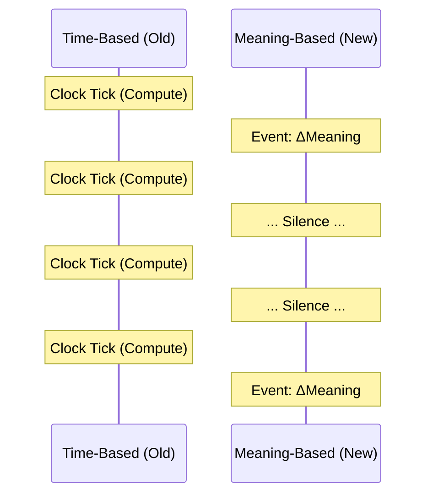
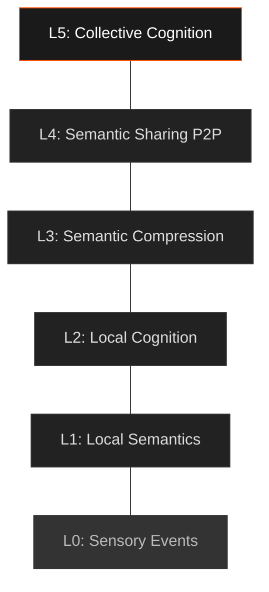
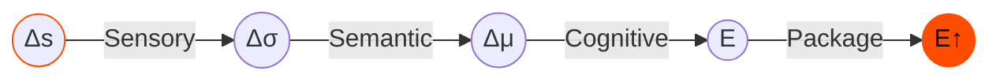
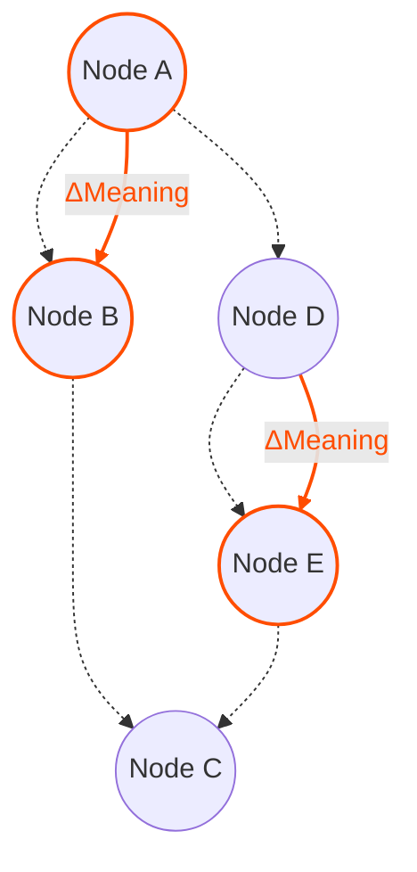

# Level 0: The Resonance Manifesto

:::info Abstract
Contemporary Artificial Intelligence is built on synchronous processing, clock cycles, global orchestration, and continuous computation. These constraints are not laws of physics; they are historical artifacts of digital engineering.

**Resonance proposes a different foundation.** Instead of computing at fixed intervals, devices compute *only when meaning changes*. Instead of transmitting raw data, nodes exchange *semantic deltas*. Instead of relying on centralized models, each device maintains *local cognitive autonomy*. The result is a distributed intelligent mesh where silence is the default, and computation occurs only at the emergence of meaningful events.
:::

---

## 1. Introduction

Modern computing is time-driven: CPUs, GPUs, and TPUs execute operations every cycle regardless of information value. Neural networks recompute entire layers even when activations are silence-dominant. Sensors emit redundant frames. Distributed systems depend on periodic pings, heartbeats, and synchronization.

This architecture is incompatible with:
* Planetary-scale edge intelligence
* Privacy-by-default device ecosystems
* Extreme energy constraints
* Local-first autonomy
* Responsive systems that awaken only to relevant change

Resonance proposes a different computation model based on one axiom: **intelligence emerges from changes in meaning, not from the passage of time.**

---

## 2. Core Axiom

> **Intelligence is triggered by meaning, not by time.**

Nodes do not compute because a clock ticks. Nodes compute because *something changes in the semantic space*.

Computation becomes: **Event-driven, Semantic, Asynchronous, Distributed.**

### The Paradigm Shift



---

## 3. Protocol Invariants

### Invariant 1: Silence is the Default State
Nodes remain inactive unless a semantic event occurs. No periodic heartbeats are required at the semantic level. Silence is meaningful and expected.

### Invariant 2: Events Carry Meaning, Not Raw Data
The fundamental unit is the **Semantic Event**:

```
E = (context, Δmeaning, confidence, provenance)
```

Events communicate change in semantic space, not raw sensor outputs or model states.

### Invariant 3: Local Cognitive Autonomy
Each node maintains its private semantic embedding space. Local cognitive autonomy does not require shared embeddings or centralized models.

### Invariant 4: Semantic Distance and Threshold
A semantic event MUST be emitted when the distance *d* between the current state and the last transmitted state exceeds a threshold *θ*:

```
d(M_t, M_{t-1}) > θ
```

### Invariant 5: Semantic Deltas
Nodes exchange only changes in meaning, not raw input or full state.

### Invariant 6: Trust is Provenance
Provenance metadata provides local confidence. There is no global root of trust (Authority).

---

## 4. The Resonance Stack

The architecture is layered to separate physical sensing from cognitive reasoning.



---

## 5. Semantic Event Lifecycle

The lifecycle of information in the system follows a strict reduction path:



1.  **Sensory Change (Δs):** Detected by DVS/Audio.
2.  **Semantic Shift (Δσ):** Crossing the threshold.
3.  **Cognitive Update (Δμ):** Internal model update.
4.  **Event Creation (E):** Packaging the delta.
5.  **Sharing (E↑):** Propagation to the mesh.

---

## 6. Topology: The Quiet Mesh

The network topology is dynamic and sparse. Nodes form a mesh where connections are maintained, but **traffic is zero** until a meaningful event propagates.



---

## 7. Conclusion

Resonance proposes a semantic-first, event-driven architecture for distributed intelligence.

**The clock stops. The resonance begins.**
