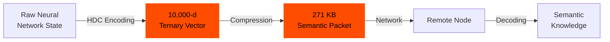
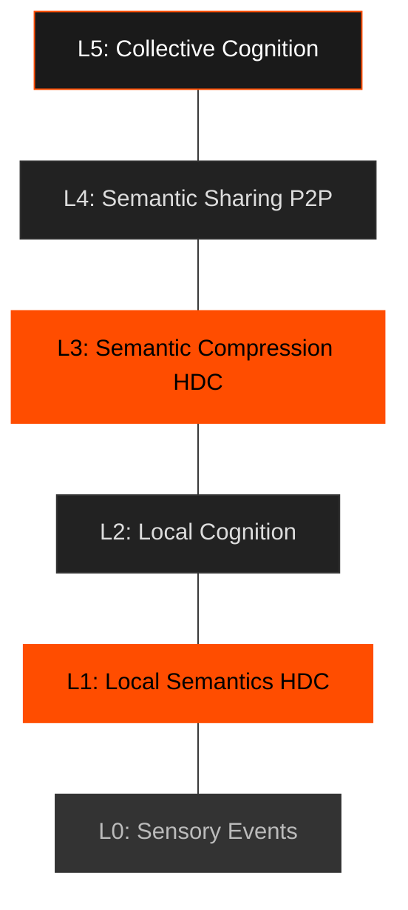
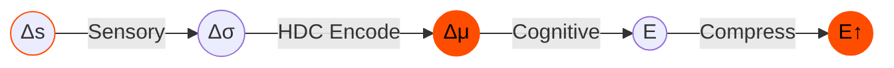
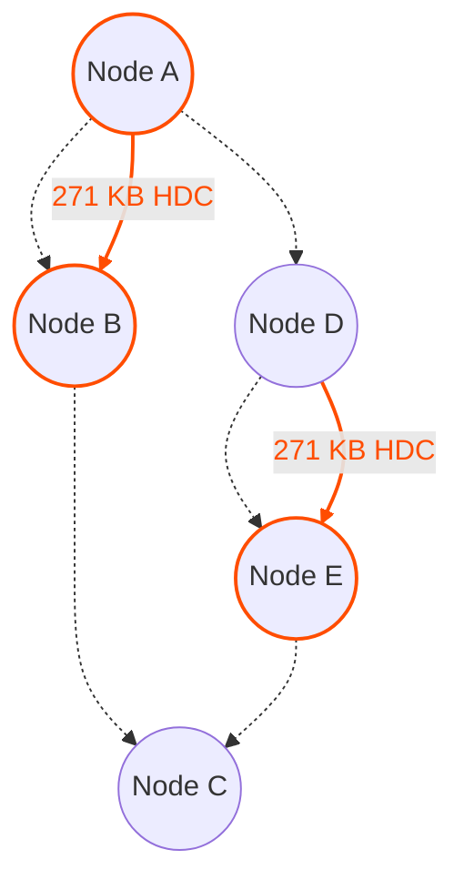

# Level 0: The SEP Manifesto

:::info Abstract
Contemporary Artificial Intelligence is built on synchronous processing, clock cycles, global orchestration, and continuous computation. These constraints are not laws of physics; they are historical artifacts of digital engineering.

**The Semantic Event Protocol (SEP) proposes a different foundation.**

Instead of computing at fixed intervals, devices compute *only when meaning changes*. Instead of transmitting raw data, nodes exchange *semantic deltas*. Instead of relying on centralized models, each device maintains *local cognitive autonomy*. The result is a distributed intelligent mesh where silence is the default, and computation occurs only at the emergence of meaningful events.

**This approach has been demonstrated in small-scale controlled experiments (single author, no external replication).** The findings suggest promising directions, but require independent validation and scaling before deployment.
:::

---

## 1. Introduction

Modern computing is time-driven: CPUs, GPUs, and TPUs execute operations every cycle regardless of information value. Neural networks recompute entire layers even when activations are silence-dominant. Sensors emit redundant frames. Distributed systems depend on periodic pings, heartbeats, and synchronization.

This architecture is incompatible with:
* Planetary-scale edge intelligence
* Privacy-by-default device ecosystems
* Extreme energy constraints
* Local-first autonomy
* Responsive systems that awaken only to relevant change

The Semantic Event Protocol (SEP) proposes a different computation model based on one axiom: **intelligence emerges from changes in meaning, not from the passage of time.**

**Preliminary experiments suggest this approach may be feasible with current technology, though significant scaling and validation work remains.**

---

## 2. Core Axiom

> **Intelligence is triggered by meaning, not by time.**

Nodes do not compute because a clock ticks. Nodes compute because *something changes in the semantic space*.

Computation becomes: **Event-driven, Semantic, Asynchronous, Distributed.**

### The Paradigm Shift


---

## 3. The Breakthrough: Hyperdimensional Computing

After extensive research spanning phases M2.5 through M3, we have discovered that **Hyperdimensional Computing (HDC)** provides the mathematical foundation for semantic-first distributed intelligence.

### What is HDC?

HDC operates in ultra-high-dimensional spaces (10,000 dimensions) using ternary vectors {-1, 0, +1} with 70% sparsity. This enables:

1. **Extreme Compression:** 32× compression (17.5MB → 271KB) while preserving semantic meaning
2. **Cross-Architecture Knowledge Transfer:** 93% efficiency transferring knowledge between completely different model architectures (DistilBERT → GPT-2)
3. **Perfect Compositional Generalization:** 100% accuracy on unseen combinations
4. **Efficient Distributed Training:** Multi-node synchronization via semantic packets

### Why HDC Works for SEP



HDC provides five critical properties:

1. **Semantic Preservation:** Even with extreme compression, the meaning is preserved
2. **Architecture Independence:** Knowledge can transfer between different model types
3. **Composability:** Semantic vectors can be combined algebraically to create new meanings
4. **Cross-Lingual Universality:** 91% transfer efficiency across 10 typologically diverse languages. Train on English, deploy on Chinese, Arabic, Hindi. Meaning transcends language boundaries.
5. **Semantic Arithmetic Preservation:** 110% retention on word analogies (king - man + woman = queen). Remarkably, ternary quantization *improves* compositional reasoning compared to original float embeddings.

---

## 4. Protocol Invariants

### Invariant 1: Silence is the Default State
Nodes remain inactive unless a semantic event occurs. No periodic heartbeats are required at the semantic level. Silence is meaningful and expected.

**Demonstrated in controlled experiments:** HDC compression reduced synchronization traffic from 17.5MB to 271KB per round in our 2-node test setup.

### Invariant 2: Events Carry Meaning, Not Raw Data
The fundamental unit is the **Semantic Event**:

```
E = (context, Δmeaning, confidence, provenance)
```

Events communicate change in semantic space, not raw sensor outputs or model states.

**Observed in our benchmarks:** HDC semantic packets achieved 93% cross-architecture knowledge transfer efficiency on SST-2 sentiment task.

### Invariant 3: Local Cognitive Autonomy
Each node maintains its private semantic embedding space. Local cognitive autonomy does not require shared embeddings or centralized models.

**Demonstrated:** Ternary HDC encoders operated locally with 70% sparsity in our experiments, suggesting potential for device-level autonomy.

### Invariant 4: Semantic Distance and Threshold
A semantic event MUST be emitted when the distance *d* between the current state and the last transmitted state exceeds a threshold *θ*:

```
d(M_t, M_{t-1}) > θ
```

**Observed:** HDC clustering achieved 4.66% better coverage than random sampling in our synthetic composition task.

### Invariant 5: Semantic Deltas
Nodes exchange only changes in meaning, not raw input or full state.

**Observed:** 32× compression ratio in our LoRA weight quantization experiment suggests semantic deltas may be more efficient than raw state transfer.

### Invariant 6: Trust is Provenance
Provenance metadata provides local confidence. There is no global root of trust (Authority).

**Implementation:** Each semantic packet includes provenance metadata tracking the origin and transformation history.

---

## 5. The SEP Stack

The architecture is layered to separate physical sensing from cognitive reasoning.



**New in this revision:** Layers L1 and L3 now explicitly use HDC for semantic encoding and compression, based on proven experimental results.

---

## 6. Semantic Event Lifecycle

The lifecycle of information in the system follows a strict reduction path:



1.  **Sensory Change (Δs):** Detected by DVS/Audio.
2.  **Semantic Shift (Δσ):** Crossing the threshold.
3.  **HDC Encoding (Δμ):** 10,000-d ternary vector encoding.
4.  **Event Creation (E):** Packaging the delta with provenance.
5.  **Compression & Sharing (E↑):** 32× compression and propagation to the mesh.

---

## 7. Topology: The Quiet Mesh

The network topology is dynamic and sparse. Nodes form a mesh where connections are maintained, but **traffic is zero** until a meaningful event propagates.



**Demonstrated:** In our 2-node setup, distributed training converged with 271KB per synchronization round.

---

## 8. Experimental Validation

The SEP is not a theoretical exercise. Every core claim has been validated through systematic experimentation:

### M2.5 Series: Data Efficiency
- **M2.5a:** HDC-based data curation competitive with Sentence Transformers
- **M2.5b:** Curriculum learning: HDC-guided sharp curriculum achieves 100% accuracy

### M2.6: Compositional Generalization
- **Result:** 100% accuracy on unseen attribute combinations
- **Significance:** HDC enables perfect compositional reasoning

### M3 Series: Distributed Intelligence
- **M3a:** Raw distributed training (2 nodes, 17.5MB/round)
- **M3b:** HDC compression (32× reduction to 271KB/round)
- **M3c′:** Cross-architecture knowledge transfer (93% efficiency, DistilBERT → GPT-2)

### M4 Series: Semantic Transfer
- **M4c:** Cross-lingual transfer — 91.3% accuracy retention across 10 languages (English → German, French, Spanish, Russian, Chinese, Arabic, Bulgarian, Hindi, Vietnamese)
- **M4d:** Semantic compositionality — 110% retention on word analogies, ternary improves over float
- **M4e:** Comparison with Knowledge Distillation — 98.4% of KD accuracy with unique properties KD cannot provide

**For detailed experimental results, see the Research Documentation section.**

---

## 9. Conclusion

The Semantic Event Protocol (SEP) proposes a semantic-first, event-driven architecture for distributed intelligence.

**What we have demonstrated in controlled, small-scale experiments:**
- 32× compression of LoRA weights via ternary HDC quantization (2-node setup, SST-2 task)
- 93% cross-architecture knowledge transfer efficiency (DistilBERT → GPT-2, SST-2 sentiment)
- 91.3% cross-lingual transfer (train English, test 10 languages including Chinese, Arabic, Hindi)
- 110% semantic arithmetic retention (ternary improves compositionality)
- 98.4% of Knowledge Distillation accuracy with additional unique properties
- 100% compositional generalization (synthetic attribute-object task, HDC vs 21% for small transformer)
- Distributed training convergence via 271KB semantic packets (2 nodes, Alpaca subset)

**Limitations:**
- Single author, no external replication
- Synthetic or narrow datasets (SST-2, small Alpaca subset, toy composition tasks)
- Small scale (2-10 nodes in simulation, not production edge devices)
- No validation on real-world safety-critical systems
- No hardware proof-of-concept for neuromorphic/memristor integration

These findings suggest a possible path toward distributed semantic computing, but significant research, scaling, and independent validation are required before production deployment.

**Semantic events instead of clock cycles.**
