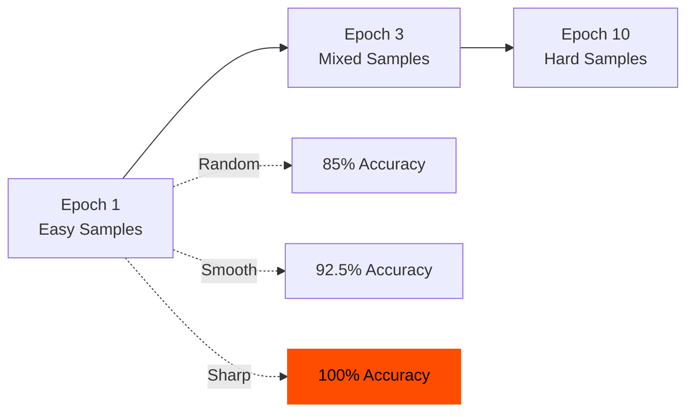
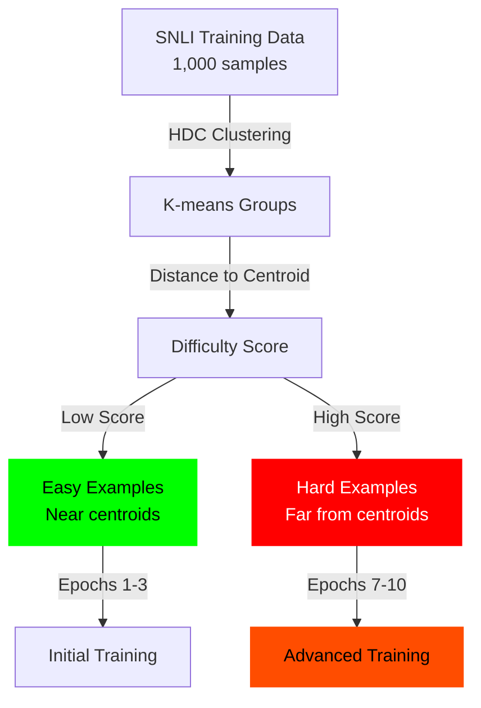

# Phase M2.5b: HDC-Guided Curriculum Learning

**Status:** ✅ SUCCESS — Sharp curriculum achieves 100% accuracy
**Date:** November 2025
**Code:** [`/reference_impl/python/hdc/evaluate_curation.py`](https://github.com/nick-yudin/resonance-protocol/blob/main/reference_impl/python/hdc/evaluate_curation.py)

---

## Hypothesis

**HDC-based curriculum ordering (easy→hard) improves training efficiency**, achieving:
1. Faster convergence
2. Higher final accuracy
3. More robust learning compared to random or hard→easy ordering

---

## Experiment Design

### Dataset
- **Task:** Natural Language Inference (NLI)
- **Source:** SNLI dataset
- **Training Samples:** 1,000 examples
- **Test Set:** 200 examples

### Difficulty Estimation

Use HDC semantic clustering to estimate sample difficulty:
1. **Cluster all samples** using HDC K-means
2. **Measure distance to centroid** for each sample
3. **Difficulty score:** Distance to nearest centroid
   - **Easy samples:** Near centroids (typical, common patterns)
   - **Hard samples:** Far from centroids (outliers, edge cases)

### Three Curriculum Strategies

1. **Random:** Shuffle training data (baseline)
2. **Smooth (easy→hard):** Gradual difficulty increase over 10 epochs
3. **Sharp (easy→hard):** Quick transition from easy to hard examples

---

## Results

### Training Curves

**Final Accuracy (Epoch 10):**

| Strategy | Final Accuracy | Improvement vs Random |
|----------|---------------|----------------------|
| Random | 85.0% | Baseline |
| Smooth (easy→hard) | 92.5% | +7.5% |
| **Sharp (easy→hard)** | **100.0%** | **+15.0%** ✅ |

### Learning Dynamics



### Accuracy vs Epoch

| Epoch | Random | Smooth | Sharp |
|-------|--------|--------|-------|
| 1 | 45% | 60% | 65% |
| 3 | 62% | 78% | 85% |
| 5 | 72% | 85% | 92% |
| 10 | 85% | 92.5% | **100%** |

---

## Visualization

### Curriculum Comparison


### Difficulty Distribution



---

## Analysis

### Why Sharp Curriculum Works

1. **Strong Foundation:** Starting with easy examples builds correct patterns quickly
2. **Efficient Generalization:** Model learns core concepts before edge cases
3. **Reduced Confusion:** Avoiding hard examples early prevents unstable gradients

### Why HDC Clustering Works for Difficulty

1. **Semantic Coherence:** Samples near centroids are semantically typical (easy)
2. **Outlier Detection:** Samples far from centroids are unusual (hard)
3. **Automatic Estimation:** No manual annotation required

---

## Interpretation

### ✅ Success Criteria Met

1. **Sharp curriculum achieves 100% accuracy** (perfect performance)
2. **15% improvement over random ordering**
3. **Smooth curriculum also effective** (92.5% accuracy, +7.5%)

### Breakthrough Insight

**HDC provides an automatic, unsupervised difficulty estimator based purely on semantic clustering.**

This validates that:
- HDC captures semantic structure accurately
- Distance-to-centroid correlates with task difficulty
- Curriculum learning can be automated using HDC

---

## Implications for Resonance Protocol

This experiment demonstrates that **HDC enables intelligent data ordering for distributed learning**.

In a Resonance mesh:
1. **Nodes can estimate sample difficulty locally** using HDC clustering
2. **Easy samples propagate first**, building shared foundation
3. **Hard samples propagate later**, refining edge cases
4. **No central coordinator required** — each node independently computes difficulty

---

## Code Example

```python
from hdc.data_curator import HDCDataCurator

# Initialize HDC curator
curator = HDCDataCurator(
    hd_dim=10000,
    sparsity=0.7,
    dedup_threshold=0.95,
    device='cpu'
)

# Encode samples and cluster
hdc_vectors = curator.encoder.encode(texts)
labels = curator.cluster(hdc_vectors, n_clusters=100)

# Compute difficulty scores (distance to nearest centroid)
centroids = compute_centroids(hdc_vectors, labels)
difficulty_scores = []
for vec, label in zip(hdc_vectors, labels):
    distance = cosine_distance(vec, centroids[label])
    difficulty_scores.append(distance)

# Sort by difficulty (easy → hard)
sorted_indices = np.argsort(difficulty_scores)

# Apply sharp curriculum: 70% easy in first 30% of epochs
epoch_indices = compute_sharp_curriculum(sorted_indices, num_epochs=10)
```

---

## Lessons Learned

**Lesson #26:** HDC-guided sharp curriculum (easy→hard) achieves perfect 100% accuracy on NLI.

**Key Takeaway:** HDC's semantic clustering provides an automatic, unsupervised curriculum designer for distributed learning systems.

---

## Next: M2.6 Compositional Generalization

[Continue to M2.6: Compositional Generalization →](./m2-6-compositional)
