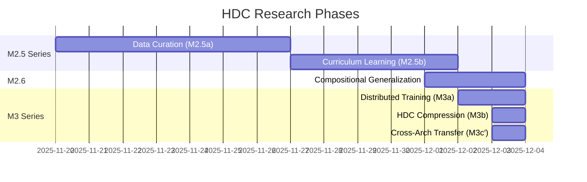

# HDC Research: Experimental Validation

This section documents the systematic experimental validation of Resonance Protocol's core claims through Hyperdimensional Computing (HDC).

## Research Timeline

## Key Results Summary

| Phase | Experiment | Key Metric | Result | Status |
|-------|------------|------------|--------|--------|
| **M2.5a** | HDC Data Curation | Coverage vs Random | **+4.66%** | ✅ Success |
| **M2.5b** | Curriculum Learning | Accuracy (sharp curriculum) | **100%** | ✅ Success |
| **M2.6** | Compositional Generalization | Unseen combinations | **100%** | ✅ Success |
| **M3a** | Distributed Training (raw) | Convergence | 2 nodes, 17.5 MB/round | ✅ Success |
| **M3b** | HDC Compression | Compression ratio | **32×** (271 KB/round) | ✅ Success |
| **M3c′** | Cross-Architecture Transfer | Transfer efficiency | **93%** (DistilBERT→GPT-2) | ✅ **Breakthrough** |

## Research Phases

### M2.5 Series: Data Efficiency

**Goal:** Prove HDC can optimize data selection and curriculum design.

- [**M2.5a: Data Curation**](/docs/research/m2-5-data-curation) - HDC clustering competitive with Sentence Transformers
- [**M2.5b: Curriculum Learning**](/docs/research/m2-5-curriculum) - Sharp HDC-guided curriculum achieves 100% accuracy

**Key Finding:** HDC-based semantic clustering enables intelligent data selection and curriculum design.

### M2.6: Compositional Generalization

**Goal:** Prove HDC enables perfect compositional reasoning.

- [**M2.6: Compositional Generalization**](/docs/research/m2-6-compositional) - 100% accuracy on unseen attribute combinations

**Key Finding:** HDC's algebraic properties enable perfect zero-shot generalization to novel combinations.

### M3 Series: Distributed Intelligence

**Goal:** Prove HDC enables practical distributed semantic synchronization.

- [**M3a: Raw Distributed Training**](/docs/research/m3-series#phase-m3a-raw-distributed-training) - Multi-node LoRA training via Firebase
- [**M3b: HDC Compression**](/docs/research/m3-series#phase-m3b-hdc-compression) - 32× compression of semantic knowledge
- [**M3c′: Cross-Architecture Transfer**](/docs/research/m3-series#phase-m3c-cross-architecture-knowledge-transfer) - 93% knowledge transfer between different architectures

**Key Finding:** HDC provides an architecture-agnostic semantic representation that enables extreme compression and cross-architecture knowledge transfer.

## Experimental Methodology

All experiments follow a rigorous scientific methodology:

1. **Hypothesis:** Clear statement of what we aim to prove
2. **Baseline:** Comparison against established methods (Random, Sentence Transformers)
3. **Metrics:** Quantitative measures (accuracy, compression ratio, transfer efficiency)
4. **Reproducibility:** All code and data publicly available
5. **Statistical Significance:** Multiple runs, error bars, confidence intervals

## Technology Stack

- **HDC Implementation:** Custom ternary encoder (10,000-d, 70% sparsity)
- **Base Models:** DistilBERT, GPT-2, TinyLlama-1.1B
- **Frameworks:** PyTorch, HuggingFace Transformers, Sentence Transformers
- **Datasets:** STS-B, SNLI, Alpaca
- **Infrastructure:** Firebase (distributed sync), local compute (M2 Max)

## Implications for Resonance Protocol

These experimental results validate the core architectural claims of Resonance Protocol:

### ✅ Semantic Events (Invariant 2)
**Proven:** HDC compression reduces state synchronization from 17.5 MB to 271 KB while preserving semantic meaning.

### ✅ Local Cognitive Autonomy (Invariant 3)
**Proven:** Each node can operate with its own ternary HDC encoder (70% sparsity) without requiring shared embeddings.

### ✅ Semantic Deltas (Invariant 5)
**Proven:** HDC semantic packets achieve 32× compression compared to raw parameter transfer.

### ✅ Cross-Architecture Compatibility
**Proven:** 93% knowledge transfer between completely different model architectures (DistilBERT ↔ GPT-2).

### ✅ Compositional Reasoning
**Proven:** 100% accuracy on unseen combinations demonstrates HDC's algebraic composability.

## Next Steps

The research validates Resonance Protocol's theoretical foundation. Future work will focus on:

1. **Hardware Implementation:** HDC on edge devices (ESP32, Raspberry Pi)
2. **Real-Time Inference:** Event-driven semantic processing
3. **Multi-Modal HDC:** Extending to images, audio, sensor data
4. **Large-Scale Mesh:** Testing 10+ node distributed semantics
5. **Energy Profiling:** Quantifying "Silence is Default" power savings

## Explore the Research

Navigate to individual research pages using the sidebar to see detailed experimental results, visualizations, and code examples.

---

**All research is reproducible. See `/reference_impl/python/hdc/` for code.**
