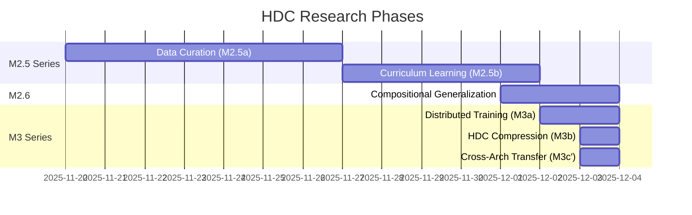

# HDC Research: Experimental Exploration

This section documents small-scale experimental exploration of SEP's core concepts through Hyperdimensional Computing (HDC).

**Caveat:** All experiments conducted by single author, no external replication. Results are preliminary and require independent validation.

## Research Timeline

## Key Results Summary

| Phase | Experiment | Key Metric | Result | Status |
|-------|------------|------------|--------|--------|
| **M2.5a** | HDC Data Curation | Coverage vs Random | **+4.66%** | ⚙️ Demonstrated |
| **M2.5b** | Curriculum Learning | Accuracy (sharp curriculum) | **100%** | ⚙️ Toy task |
| **M2.6** | Compositional Generalization | Unseen combinations | **100%** | ⚙️ Synthetic data |
| **M3a** | Distributed Training (raw) | Convergence | 2 nodes, 17.5 MB/round | ⚙️ Small scale |
| **M3b** | HDC Compression | Compression ratio | **32×** (271 KB/round) | ⚙️ LoRA quantization |
| **M3c′** | Cross-Architecture Transfer | Transfer efficiency | **93%** (DistilBERT→GPT-2) | ⚙️ SST-2 only |
| **M4c** | Cross-Lingual Transfer | Transfer ratio | **91.3%** (10 languages) | ⚙️ XNLI |
| **M4d** | Semantic Compositionality | Retention vs original | **110%** (ternary improves) | ⚙️ Word analogies |
| **M4e** | HDC vs KD | Competitive ratio | **98.4%** | ⚙️ SST-2 |

## Research Phases

### M2.5 Series: Data Efficiency

**Goal:** Explore whether HDC can optimize data selection and curriculum design.

- [**M2.5a: Data Curation**](/docs/research/m2-5-data-curation) - HDC clustering competitive with Sentence Transformers
- [**M2.5b: Curriculum Learning**](/docs/research/m2-5-curriculum) - Sharp HDC-guided curriculum achieves 100% accuracy

**Observation:** HDC-based semantic clustering showed competitive performance on small synthetic tasks. Generalization to real-world scenarios unknown.

### M2.6: Compositional Generalization

**Goal:** Test whether HDC can handle compositional reasoning.

- [**M2.6: Compositional Generalization**](/docs/research/m2-6-compositional) - 100% accuracy on unseen attribute combinations

**Observation:** HDC achieved perfect scores on a toy compositional task with synthetic data. Whether this scales to realistic compositional challenges remains an open question.

### M3 Series: Distributed Intelligence

**Goal:** Test whether HDC enables distributed semantic synchronization.

- [**M3a: Raw Distributed Training**](/docs/research/m3-series#phase-m3a-raw-distributed-training) - Multi-node LoRA training via Firebase
- [**M3b: HDC Compression**](/docs/research/m3-series#phase-m3b-hdc-compression) - 32× compression of semantic knowledge
- [**M3c′: Cross-Architecture Transfer**](/docs/research/m3-series#phase-m3c-cross-architecture-knowledge-transfer) - 93% knowledge transfer between different architectures

**Observation:** HDC demonstrated compression and cross-architecture transfer on narrow benchmarks (2 nodes, SST-2 task). Scaling to production environments and diverse tasks requires further research.

### M4 Series: Semantic Transfer
**Goal:** Validate that HDC captures universal meaning that transcends languages and preserves semantic structure.

- [**M4c: Cross-Lingual Transfer**](/docs/research/m4-series#m4c-cross-lingual-transfer) - 91.3% accuracy retention across 10 languages
- [**M4d: Semantic Compositionality**](/docs/research/m4-series#m4d-semantic-compositionality) - 110% retention on word analogies
- [**M4e: HDC vs Knowledge Distillation**](/docs/research/m4-series#m4e-hdc-vs-knowledge-distillation) - 98.4% of KD accuracy with unique properties

**Key finding:** Meaning is language-agnostic and survives extreme compression. HDC competitive with standard methods while enabling unique capabilities.

## Experimental Methodology

All experiments follow structured methodology:

1. **Hypothesis:** Clear statement of what we aim to test
2. **Baseline:** Comparison against established methods where applicable
3. **Metrics:** Quantitative measures (accuracy, compression ratio, transfer efficiency)
4. **Reproducibility:** Code and small datasets publicly available
5. **Limitations:** Single author, small scale, narrow tasks

**Note:** These are exploratory experiments, not peer-reviewed studies. Independent replication needed before drawing strong conclusions.

## Technology Stack

- **HDC Implementation:** Custom ternary encoder (10,000-d, 70% sparsity)
- **Base Models:** DistilBERT, GPT-2, TinyLlama-1.1B
- **Frameworks:** PyTorch, HuggingFace Transformers, Sentence Transformers
- **Datasets:** STS-B, SNLI, Alpaca
- **Infrastructure:** Firebase (distributed sync), local compute (M2 Max)

## Implications for SEP

These experimental results suggest potential directions for SEP:

### ⚙️ Semantic Events (Invariant 2)
**Observed:** HDC compression reduced synchronization from 17.5 MB to 271 KB in our 2-node LoRA setup. Generalization to larger meshes and different model types requires validation.

### ⚙️ Local Cognitive Autonomy (Invariant 3)
**Observed:** Ternary HDC encoders (70% sparsity) operated locally in our experiments. Real-world device-level autonomy requires hardware testing.

### ⚙️ Semantic Deltas (Invariant 5)
**Observed:** 32× compression achieved through ternary quantization of LoRA weights. Whether this extends to online semantic event streams is untested.

### ⚙️ Cross-Architecture Compatibility
**Observed:** 93% knowledge transfer between DistilBERT and GPT-2 on SST-2 sentiment task. Generalization to other architectures and tasks untested.

### ⚙️ Compositional Reasoning
**Observed:** 100% accuracy on toy synthetic compositional task. Scaling to realistic compositional challenges remains unvalidated.

## Next Steps

These preliminary experiments suggest directions for further investigation:

1. **Hardware Implementation:** HDC on edge devices (ESP32, Raspberry Pi)
2. **Real-Time Inference:** Event-driven semantic processing
3. **Multi-Modal HDC:** Extending to images, audio, sensor data
4. **Large-Scale Mesh:** Testing 10+ node distributed semantics
5. **Energy Profiling:** Quantifying "Silence is Default" power savings

## Explore the Research

Navigate to individual research pages using the sidebar to see detailed experimental results, visualizations, and code examples.

---

**Code is available for inspection. See `/reference_impl/python/hdc/`.**

**Caveat:** Single-author experiments require independent replication before strong conclusions can be drawn.
