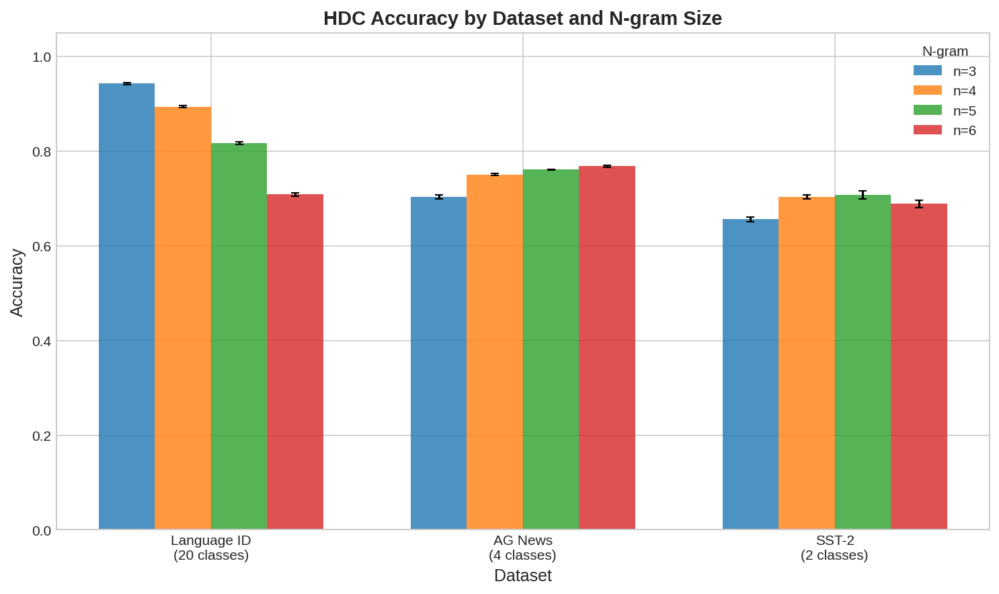
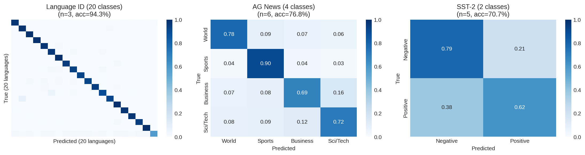
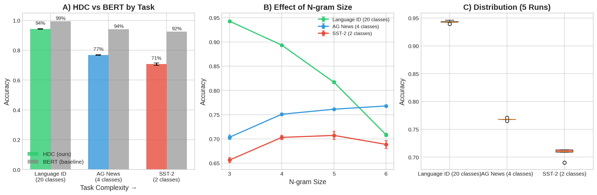

# Encoder-Free Text Classification Using Hyperdimensional Computing

Experimental validation of Hyperdimensional Computing (HDC) for text classification **without neural network encoders**. Using only character n-grams hashed to ternary vectors, we achieve competitive accuracy on pattern-based tasks while running on microcontrollers with <4KB memory.

**Published:** [Zenodo (2025)](https://doi.org/10.5281/zenodo.18025695) | **Paper PDF:** [paper2_encoder_free_hdc.pdf](../../papers/Encoder_Free_HDC/paper2_encoder_free_hdc.pdf)

## Overview

Modern NLP relies on neural network encoders (BERT, transformers) that require gigabytes of memory and GPU acceleration. This work investigates: **How much accuracy must we sacrifice to eliminate the neural encoder entirely?**

Our method (HyperEmbed):
1. Extract character n-grams (e.g., "cat" → ["cat", "at ", "t  "])
2. Hash each n-gram to a random ternary vector {-1, 0, +1}
3. Bundle all n-gram vectors into a single text representation
4. Compare against class prototypes using cosine similarity

**No neural networks. No training. Only integer operations.**

## Key Question

Can encoder-free HDC compete with BERT on text classification tasks?

**Answer:** It depends on the task complexity.

## Results Summary

All BERT baselines were measured on **identical test data** (not literature values) for fair comparison.

| Task | Classes | HDC Accuracy | BERT Accuracy | Gap | Task Type |
|------|---------|--------------|---------------|-----|-----------|
| **Language ID** | 20 | **94.3%** ± 0.2% | 99.4% | 5.1% | Pattern-based |
| **Topic (AG News)** | 4 | **76.8%** ± 0.3% | 94.1% | 17.3% | Keyword-based |
| **Sentiment (SST-2)** | 2 | **70.7%** ± 0.4% | 92.4% | 21.7% | Semantic |

### Key Findings

1. **Pattern-based tasks:** HDC achieves 94%+ accuracy (only 5% behind BERT)
   - Language identification relies on character patterns (suffixes, prefixes)
   - Character n-grams capture these patterns effectively

2. **Keyword-based tasks:** HDC achieves 76-77% accuracy (17% behind BERT)
   - Topic classification benefits from keywords ("sports", "business")
   - N-grams capture some keywords but miss compositional semantics

3. **Semantic tasks:** HDC struggles at 70% accuracy (22% behind BERT)
   - Sentiment analysis requires understanding context and negation
   - "Not bad" vs "bad" — character n-grams cannot distinguish

### N-gram Size Comparison



- **Language ID:** n=3 (trigrams) is optimal (94.3%)
- **AG News:** n=4-5 performs best (76.8%)
- **SST-2:** All n-gram sizes plateau around 70%

### Confusion Matrices



Visualization of classification errors across all three tasks, revealing where encoder-free HDC succeeds and fails.

### Complete Results Visualization



Comparison of HDC vs BERT across all tasks, showing the accuracy-efficiency tradeoff.

## Visual Results

### Results Table (PDF)


Complete numerical results with statistical validation (mean ± std over 5 runs).

## Notebooks

### Statistical Validation Experiment

**File:** [notebooks/Paper2_StatisticalValidation.ipynb](notebooks/Paper2_StatisticalValidation.ipynb)

**Hardware:** Google Colab CPU (no GPU needed!)

**Runtime:** ~30-45 minutes

**What it tests:**
- Language ID (WiLI-2018): 20 languages, character patterns
- Topic Classification (AG News): 4 categories, keyword detection
- Sentiment Analysis (SST-2): binary sentiment, semantic understanding
- N-gram size sweep: n ∈ {3, 4, 5, 6}
- Statistical validation: 5 independent runs per configuration
- BERT baselines: measured on identical test sets

**Requirements:**
- Python 3.8+
- NumPy, scikit-learn
- Transformers (for BERT baselines only)
- Datasets (HuggingFace)

## Reproduce Our Results

We encourage independent verification. To run:

1. Open notebook in Google Colab
2. Select **CPU runtime** (no GPU needed)
3. Run all cells

**Expected outputs:**
- `paper2_validated_results.json` — full numerical results with statistics
- `paper2_results.png` — visualization comparing HDC vs BERT
- `paper2_ngram_comparison.png` — n-gram size analysis
- `paper2_confusion_matrices.png` — error analysis
- Console output with per-task summaries

## Configuration

The experiment uses the following parameters:

```python
{
    'hdc_dim': 4096,           # HDC vector dimension (ternary: ~1KB per class)
    'ngram_sizes': [3,4,5,6],  # Character n-gram window sizes
    'max_train': 20000,        # Training samples per task
    'max_test': 5000,          # Test samples per task
    'n_runs': 5,               # Independent runs for statistical validation
    'hash_seed': 42,           # Deterministic n-gram hashing
}
```

## Key Implementation Details

**Character N-gram Hashing:**
```python
# Extract n-grams
text = "cat"
ngrams = ["cat", "at ", "t  "]  # n=3 with padding

# Hash each to ternary vector
for ngram in ngrams:
    hash_val = hash(ngram) % (2 * dim)
    if hash_val < dim:
        hdc_vector[hash_val] = +1
    else:
        hdc_vector[hash_val - dim] = -1

# Result: sparse ternary vector, no learned parameters
```

**Classification:**
```python
# Training: bundle all examples into class prototype
prototype[class_i] = sign(sum(all_vectors_for_class_i))

# Inference: find nearest prototype
similarities = cosine(input_vector, all_prototypes)
predicted_class = argmax(similarities)
```

## Deployment Characteristics

| Metric | Encoder-Free HDC | BERT-base |
|--------|------------------|-----------|
| **Model size** | 1KB per class | 440MB |
| **Memory (inference)** | <4KB | >1GB |
| **Operations** | Integer add/compare | Float32 matrix multiply |
| **Hardware** | ESP32 microcontroller | GPU/high-end CPU |
| **Latency** | <1ms | 10-100ms (CPU) |
| **Training** | None (deterministic) | Hours on GPU |

## Caveats

These results come with important limitations:

1. **Task complexity ceiling:** HDC without encoders cannot handle semantic tasks requiring compositional understanding (sentiment, NLI, paraphrase).

2. **No context modeling:** Character n-grams treat text as a bag of patterns. Word order and long-range dependencies are ignored.

3. **Language bias:** Results are for English text. Performance may differ for languages with different character distributions.

4. **Limited hyperparameter search:** We tested n ∈ {3,4,5,6} and dim=4096. Other configurations not explored.

## When to Use Encoder-Free HDC

**Good for:**
- Language identification
- Spam detection (keyword patterns)
- Named entity recognition (character patterns)
- Edge devices with <10KB memory
- Ultra-low latency requirements (<1ms)
- Privacy-critical applications (no cloud needed)

**Not suitable for:**
- Sentiment analysis
- Semantic textual similarity
- Question answering
- Any task requiring deep compositional understanding

## Links

- Project: https://seprotocol.ai
- Repository: https://github.com/nick-yudin/SEP
- Contact: 1@seprotocol.ai
